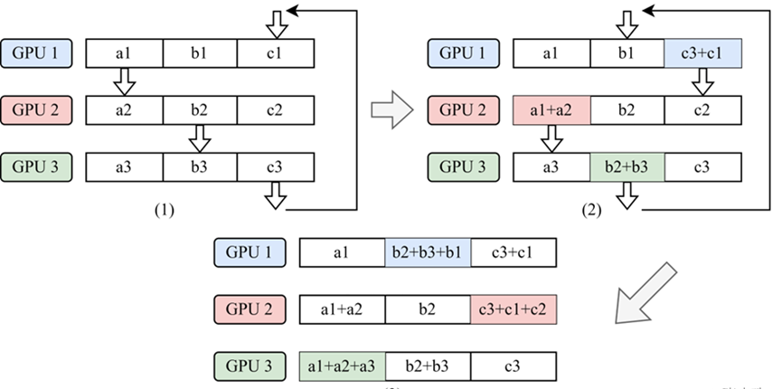
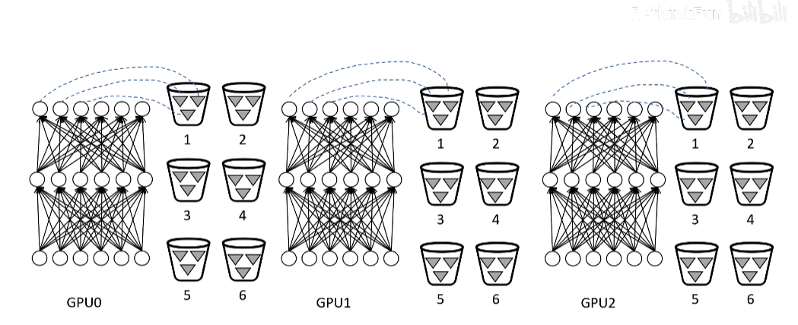

#### DataParallel (DP)

```mermaid
graph LR
    A[数据分发] --> B[模型复制]
    B --> C[前向传播]
    C --> D[输出汇总]
    D --> E[损失计算]
    E --> F[梯度分发]
    F --> G[反向传播]
    G --> H[梯度更新]

```
1. **数据分配**：将每个Batch的数据分为若干个sub-batch，分配给每个GPU。

2. **参数复制**：各个GPU并行地从核心GPU复制模型参数。

3. **并行计算**：各个GPU并行执行forward操作，得到output。

4. **结果汇总**：核心GPU从各个GPU处汇总output结果，并计算Loss。

5. **Loss广播**：核心GPU将Loss广播到各个GPU上，每个GPU并行计算梯度。

   ```python
   if self.args.n_gpu > 1:
       loss = loss.mean()  # mean() to average on multi-gpu parallel training
   ```

6. **梯度汇总**：核心GPU从每个GPU处汇总梯度。

7. **参数更新**：核心GPU更新自己的参数。

- **master:GPU**:
  - 传入梯度：(N-1)$\psi$
  - 传出参数：(N-1)$\psi$

- **其他GPU**:
  - 传出梯度：$\psi$
  - 传入参数：$\psi$

- **实现简单**：易于设置和使用。
- **仅支持单机多卡**：无法跨多台机器进行训练。
- **显存负载不均衡**：不同GPU之间的显存使用可能不均衡。
- **不支持Apex的混合精度训练**：无法利用混合精度训练来加速训练过程。
- **GPU利用不均衡**：不同GPU的计算负载可能不均衡。
- **受Python的GIL争用影响**：仅支持单进程多线程，训练速率较低。

####  DistributedDataParallel (DDP)

1. **准备阶段**：模型在每个GPU上复制一份，shuffle后的batch数据被等分到不同的GPU上进行计算。每个进程从磁盘加载自己的数据。

2. **训练阶段**：

   ```python
   from torch.nn.parallel import DistributedDataParallel as DDP
   ```

   - **前向传播**：每个GPU独立执行损失函数的计算，无需收集网络输出。

   - **反向传播**：在反向传播阶段，各GPU通过数据并行的方式处理不同的数据块，并计算各自的梯度。为了同步梯度信息，集群中的GPU使用**Ring All Reduce**算法进行通信。该算法通过两个基本操作实现：**reduce-scatter** 和 **all-gather**。

     具体来说，假设 `GPU1` 的梯度向量并将其分块为 [a1;b1;c1][*a*1;*b*1;*c*1]。首先，执行 **reduce-scatter** 操作，各GPU将各自的梯度分块发送给其他GPU，并在接收端对这些分块进行累加，得到部分聚合的梯度。接着，执行 **all-gather** 操作，将聚合后的梯度分块广播给所有GPU，确保每个GPU最终获得相同的平均梯度副本。

     通过这种方式，所有GPU在反向传播结束时都能得到一致的全局平均梯度，从而实现梯度的同步和模型的更新。

     + **reduce-scatter**

       step1 ：每个结点把本设备上的数据分成 N个区块；

       step2 ：在第一次传输和接收结束之后，在每一个结点上累加了其他节点一个块的数据;

       step3 :   每一个节点上都有一个包含局部最后结果的区块;

     

     + **all gather**: 

       `All gather`阶段并不需要将接收到的值进行累加，而是直接使用接收到的块内数值去替环原来块中的数值。迭代N一1次直到过程结束, 使得每一个节点都包含了全部块数据结果;

       

   - **参数更新**：各进程使用平均梯度在所有GPU上执行梯度下降，更新自己的参数。由于初始参数和更新梯度一致，更新后的参数完全相同。

   - **为了提升性能**，DDP将**模型参数划分为多个小的bucket**，并在**bucket级别**进行`allreduce`操作。这样，**当一个bucket的梯度计算完成后**，可以立即开始通信，而其他bucket的梯度仍在计算中。这种设计实现了计算和通信过程的时间重叠，从而优化了整体性能。

     

3. **启动方式**：

   使用 `torchrun` 启动脚本比使用 `mp.spawn()` 更为简便。`torchrun` 自动处理环境变量的设置，用户只需设置 `os.environ['CUDA_VISIBLE_DEVICES']` 来指定可见的 GPU
   
   ```python
   CUDA_VISIBLE_DEVICES=0,1 torchrun --nproc_per_node=2 main.py
   ```
   
   **多节点情况**：如果是多节点训练，还需要指定 `--nnodes`（节点总数）和 `--node_rank`（当前节点的排名），以及 `--master_addr` 和 `--master_port`（主节点的地址和端口）
   
   ```python
   torchrun \
       --nnodes=2 \               # 总节点数
       --nproc_per_node=4 \       # 每个节点的进程数（GPU数）
       --node_rank=0 \            # 当前节点的排名
       --master_addr="192.168.1.1" \  # 主节点的 IP 地址
       --master_port=29500 \      # 主节点的端口号
       main.py                    # 要运行的脚本
   ```
   
   

- **配置复杂**：设置相对复杂，需要更多的配置步骤。
- **支持单机多卡&多机多卡**：可以在单台机器或多台机器上进行训练。
- **数据分配较为均衡**：数据在GPU之间的分配更加均衡。
- **支持混合精度训练**：可以利用混合精度训练来加速训练过程。
- **借助ALL-Reduce的数据交换方式提高GPU间的通讯效率**：通过ALL-Reduce方法提高GPU之间的通信效率。
- **启动多进程提高训练速率**：通过多进程来提高训练速度。

+ **通信开销**：

  假设有 $N$个工作结点，每一个结点中的数据量大小都是$K$, 分块后每个节点每次传输实际数据量$\frac{K}{N}$,   **reduce-scatter** 和 **all gather** 分别循环$N-1$次，故每个节点通信通量是
  $$
  communication = 2 * K*(N-1)/N
  $$
  

#### Pipeline Parallelism

+ **GPine**

  GPipe是通过将一个batch的数据拆分为micro-batch实现，并且每一个batch完成后会等待[全局同步梯度]；同时，GPipe用Re-materialization技术(gradient checkpoint)，用时间换来了显存的降低。

  

   GPipe 存在一些缺点，主要包括：

  1. **气泡时间（Bubble Time）**：由于 GPipe 需要等待所有 micro-batch 的前向传播完成后才开始反向传播，导致计算资源在等待过程中闲置，形成“气泡时间”。
  2. **中间激活值不能立即释放**：在前向传播过程中，中间激活值需要保留到反向传播时使用，导致显存占用较高，即使使用了 Re-materialization 技术。

+ **1F1B**

  1F1B 通过交错执行前向传播和反向传播，使得每个设备在完成一个 micro-batch 的前向传播后，立即开始反向传播。当第一个设备完成前向传播后，立即开始反向传播（B），同时第二个设备继续执行前向传播。后续设备依次交替执行前向传播和反向传播，形成“1F1B”的模式。

#### Deepspeed 

+ `ZERO` 原理：

  - `ZERO1`: 将**优化器状态**（如动量）分布到多个 GPU 上，而不是在每个 GPU 上存储完整的优化器状态。这种方式显著减少了每个 GPU 的内存占用，尤其是在使用 Adam 等内存密集型优化器时。
    **参数量**: $\psi$,  **进程数**: N,   梯度收集阶段: (N-1)$\psi$ / N; 参数广播阶段:(N-1)$\psi$ / N 

    总结：大大减少显存的利用，没有额外增加通讯量。通过梯度参数更新进行分区划分策略，**每个GPU仅将计算出的梯度发送给负责更新的特定GPU，而非进行广播**，从而显著减少了显存的使用，同时避免了额外的通讯开销。

  - `ZERO2`: 把 **优化器状态(optimizer states) + 梯度(gradients)** 分片到每个GPU下；

    在反向传播过程中，GPU0和GPU1负责计算最后一层的梯度，并将这些梯度以桶的形式发送给负责该层参数更新的GPU2。GPU2接收并汇总这些梯度，计算平均梯度后保存，而GPU0和GPU1在发送完梯度后立即释放这部分显存。依次类推，计算每一层梯度，并把梯度发送给负责这部分参数的GPU，其他GPU立即释放这部分参数显存占用。

    反向传播完成后，每个GPU都持有其负责参数的平均梯度，并据此更新优化器状态和参数。随后，每个GPU将更新后的参数广播给其他GPU，确保所有GPU的参数保持一致。和zero1类似，只不过每个GPU不再保存自己用不到的梯度。

    **参数量**: $\psi$,  **进程数**: N,   梯度收集阶段: (N-1)$\psi$ / N; 参数广播阶段:(N-1)$\psi$ / N 

  - `ZERO 3`: 把**优化器状态(optimizer states) + 梯度(gradients) + 模型参数(parameters)** 分片到每个GPU下。

    每块 GPU 只存储自己负责的参数分区，其他分区的参数不存储，从而显著减少单块 GPU 的内存占用。在前向传播过程中，每层计算需要特定的参数。如果当前 GPU 没有所需的参数分区，它会向其他 GPU 请求。当前层的计算完成后，GPU 会立即释放这些临时存储的参数，以节省内存。**即前向传播和反向传播都需要广播参数，各广播一遍。**

    **参数量**: $\psi$,  **进程数**: N,   梯度收集阶段: (N-1)$\psi$ / N;  参数广播阶段: **2* (N-1)$\psi$ / N** 

+ `混合精度训练`

  浮数形式表示 =  符号位  +  指数位  +  小数位

  | 格式 | 总位数 | 符号位 | 指数位 | 小数位 | 特点                                    | 适用场景                            |
  | ---- | ------ | ------ | ------ | ------ | --------------------------------------- | ----------------------------------- |
  | FP32 | 32位   | 1位    | 8位    | 23位   | 高精度，范围大（±3.4×10^38）            | lay_norm, cross_entropy,log_softmax |
  | BF16 | 16位   | 1位    | 8位    | 7位    | 范围与FP32相同，精度较低（约2位有效数） |                                     |
  | FP16 | 16位   | 1位    | 5位    | 10位   | 范围较小（±6.5×10^4），精度中等         | linear,matmul                       |

  ```
  +-------------------+       +-------------------+       +-------------------+
  | FP32 Master Weights| ----> | FP16 Weights      | ----> | 前向传播          |
  +-------------------+       +-------------------+       +-------------------+
                                      |                            ^
          ----------------------------                             |   
          v                                                        |
  +-------------------+       +-------------------+       +-------------------+
  | 后向传播          | <---- | Activations (FP16)|         | Inputs (FP16)     |
  +-------------------+       +-------------------+       +-------------------+
          |
          v
  +-------------------+       +-------------------+
  | Weights Grad (FP16)| ----> | FP32 Master Weights|
  +-------------------+       +-------------------+
  ```

  **混合精度训练**的具体技术包括：

  - 维护FP32的主副本权重：在前向传播和反向传播中使用FP16，但在更新权重时将梯度转换回FP32，并累加到FP32的权重副本上。这样可以确保权重更新的准确性和稳定性。
  - 损失缩放(loss scaling)：为了防止梯度值过小导致下溢的问题，在反向传播之前对loss进行放大处理，使得梯度值能够在FP16范围内有效表示，更新时再将梯度值缩放回原来的大小。
  - 算术精度累积：在执行如向量点积、求和等操作时，需要在更高的精度下累积部分中间结果，以避免FP16的精度限制带来的数值误差。

+ `Zero-Offload`

  `ZeRO-Offload` 的核心思想是将训练过程中的某些模型状态（如优化器状态、梯度、参数等）从GPU内存卸载到CPU内存中。通过这种方式，可以显著减少GPU内存的占用，从而允许在有限的GPU内存下训练更大的模型。

  在`ZeRO-Offload`中，计算节点和数据节点分布在GPU和CPU上。具体来说：

  - **GPU**：负责计算密集型的任务，如前向传播（FWD）和反向传播（BWD）。这些任务的计算复杂度通常是O(MB)，其中M是模型参数的数量，B是批量大小。

  - **CPU**：负责计算量较小的任务，如参数更新（Param update）和数据类型转换（float2half）。这些任务的计算复杂度通常是O(M)，并且需要与优化器状态（如Adam状态）进行交互。

    

​		          

  


