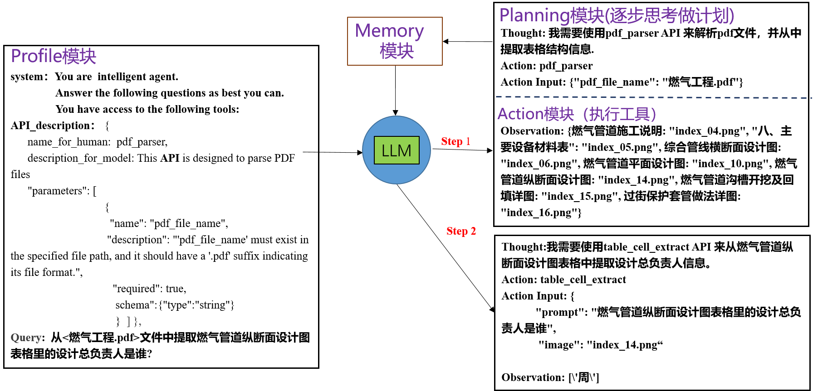

## `AGENT`  软件操作流程自动化

+ ### 需求分析和现状

  **软件操作**方法往往依赖工程师手动操作软件上数据信息并使用繁琐的流程公式进行计算，这一过程既耗时又容易出错。采用Agent技术，打造AI数字员工能够处理软件中的复杂信息，代替人执行繁琐操作。使用AI数字员工为用户带来的好处是显著提高工程管理的效率和精度。首先，通过Agent自动化操作，工程师可以节省大量的时间，将精力投入到更需要人工判断和决策的环节。其次，AI的高精度计算减少了人为错误，确保了工程预算和进度的准确性。

+ ### 技术路线

​      **Agent技术手段：**Agent架构 主要有 Profile模块、Memory模块、Planning模块和Action模块组成，各模块相互协调合作完成用户目标。
​      其核心本质是 `AI—AI`对话，是 `task_oriented`对话系统，根据用户所提问`query`来完成一项具体的领域任务。
​      举例：采用`AGENT`技术取代`chat-pdf`,实现文档级别问答，效果更佳明显。

+ ### `agent` 结合`RPA`应用场景 

​       软件操作系统的主要操作按钮包括：打开、点击文本、点击图标、上下页、输入、勾选、返回、退出等。每次操作都对应于Action模型中的执行命令。基于此，可以考虑利用大模型来替代人工，自动选择并执行这些操作按钮。

**实现方式1：** Agent 以类人的方式与操作软件平台界面进行交互，使用点击和滑动等底层操作来操作图形用户界面。

**实现方式2：** 通过系统后端访问和函数调用进行操作，来完成特定任务。

**实现方法分析：**

方式1： 只在GUI层面操作，不需要深度系统集成，算量操作平台具有一定安全性和隐私性，确保长期的适用性和灵活性（不随着软件版本更新发生变化）。但不足点在于，该Agent底座大语言模型需要具备多模态能力，其模型输入必备三要素：**（用户问题，历史操作记录，截屏信息）**，难以准确标定图标位置。

 方式2： 根据用户问题，自动生成一连贯的可执行的操作计划，并发送给后端程式，后端程式发起响应，缺点在于 Agent 系统与平台系统**代码层次上是高耦合**。优点在于：无需对操作界面进行感知，有效降低大模型理解，推理的难度，易于实现。