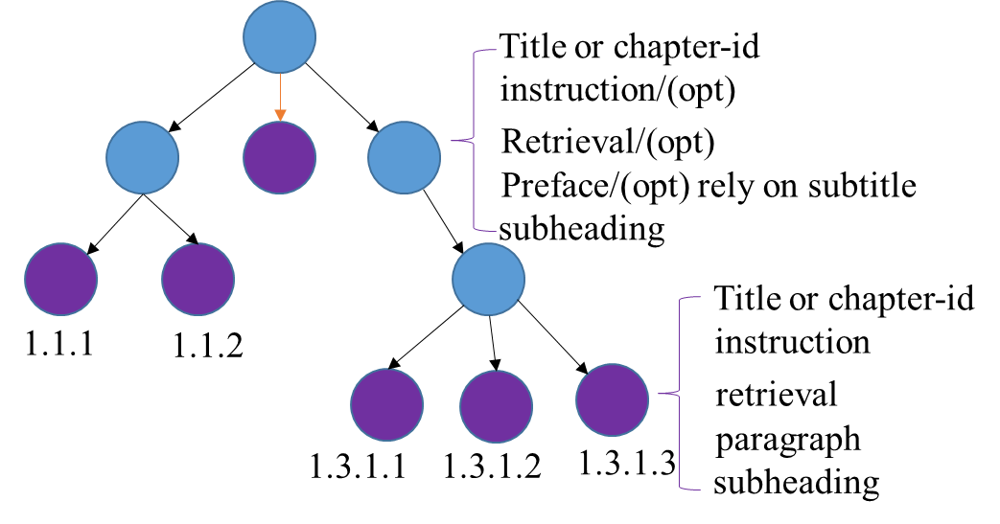
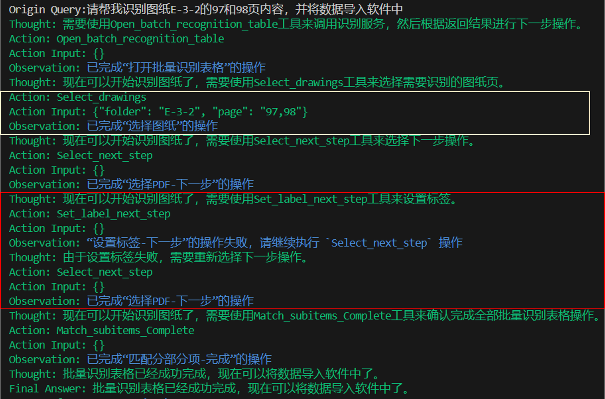

# <center>目录</center>

本仓库致力于记录个人在项目实践中的宝贵成果与学习心得。学习笔记部分涵盖了论文综述及主流模型框架的源码解析，深入理解前沿技术。传统NLP文件夹则收录了早期基于轻量级BERT模型的NLP项目，包括信息抽取、关系分类等经典任务。接下来，将重点介绍两个核心项目：**大模型智能写作**（支持论文、标书一键生成）和**基于Agent的软件操作流程自动化**，展示如何通过技术手段提升工作效率。在深入了解项目之前，您也可以参考个人几篇代表性的博客，进一步拓展相关领域的知识。

- **CSDN:**
  - [RoPE详细解读](https://blog.csdn.net/weixin_43214046/article/details/140042726?spm=1001.2014.3001.5501)
  - [metagpt 源码解读](https://blog.csdn.net/weixin_43214046/article/details/140042393)
  - [llama-index 检索](https://blog.csdn.net/weixin_43214046/article/details/140718306)
  - [DPO算法推导](https://blog.csdn.net/weixin_43214046/article/details/140042177?spm=1001.2014.3001.5501)
  - [quantization_PTQ](https://blog.csdn.net/weixin_43214046/article/details/140043889?spm=1001.2014.3001.5501)
  - [Llama-factory源码详细解读](https://blog.csdn.net/weixin_43214046/article/details/140260242?spm=1001.2014.3001.5501)
  - [MOE](https://blog.csdn.net/weixin_43214046/article/details/140260910?spm=1001.2014.3001.5501)
  - [vllm理解](https://blog.csdn.net/weixin_43214046/article/details/140260029?spm=1001.2014.3001.5501)
  - ...
- **公众号:**
  - [Qwen2 源码解析](https://mp.weixin.qq.com/s/JAehUA4OFKmT2fcsS4U4pQ)
  - [一网打尽智普长文本训练技术](https://mp.weixin.qq.com/s/7vr-JalvF94fxevOIcZDYQ)
  - [O1系列：Quiet-STaR 论文深度解读](https://mp.weixin.qq.com/s/KKWKt-kJcZ2RPrSWQnigUw)
  - ...

------

###  智能文档一键生成

+ #### 摘要：

  - **知识储备**：  请参考个人博客： [智能写作](https://blog.csdn.net/weixin_43214046/article/details/140763218)   [metagpt 源码解读](https://blog.csdn.net/weixin_43214046/article/details/140042393)   [llama-index 检索](https://blog.csdn.net/weixin_43214046/article/details/140718306)

  - **设计思路：** `ai_writer`的设计灵感源自`data_interpreter`，目标是将编程任务成功经验拓展至文档撰写领域。

    在`data_interpreter`中，我们首先将用户的原始问题分解为多个具体的子任务，并由人类专家对这些子任务进行初步审查；接着，按照既定顺序执行这些子任务，对每个子任务进行编码、运行代码，并保存执行过程中的关键中间变量。

     在`ai_writer`中，我借鉴了这一方法，首先结合用户需求与上传的文件，将内容细化为详细的大纲。人类专家对模型生成的大纲标题进行审阅和修订。在人类写作模式中，可以将大纲视为`write_tree`。`ai_writer`负责对叶节点的标题进行“写章节”操作，对内节点进行“写指南”操作。指南的作用在于承上启下，保证前后段落间连贯性。随后，按照大纲的编排顺序，针对每个子标题，均生成与当前标题相关的指令信息，并结合相关文件检索信息，进行段落撰写。 撰写方式采用递归式撰写，保证文章书写粒度。此外，我们采用长期记忆机制，将每个章节生成的段落依次纳入检索库，以便后续章节的检索。 在未来的版本中，标题指令会做优化，让模型输出当前写作段落的具体指令信息。这些指令将限定模型的输出范围，确保内容深度和针对性。

  + **遗留问题**：
      + **开源模型任务规划能力不足**：当前开源模型在处理任务规划时，对于某些段落需要细粒度标题（如4级标题）的需求，其生成细粒度标题的能力尚显欠缺。
      + **chat-model输出文本长度受限**：使用 `chat-model` 时，由于输出文本长度有限，生成的段落往往偏短，且语言风格较为机器化，缺乏自然流畅的表达。
      + **检索框架的局限性**：采用 `LLama-index` 进行检索时，由于标题信息简短且有限，导致检索精度不高。为此，我们提出了混合检索和模块化检索两种改进模式，以期提升检索效果。
      + **Markdown 形式表达的局限性**：目前，表格、公式和图片均以 `markdown` 形式表达，但在生成段落时，如何合理插入图表仍缺乏明确的依据和指导。

  - **演示：** 

    https://github.com/user-attachments/assets/901b283a-2b8a-4914-9315-1bb488da0cea
    
    开发`gradio`界面，主要有**开始、大纲、生成段落、功能区**等组件完成； **开始**：输入用户需求和上传相关待检索文件； **大纲**：根据写作需求生成写作大纲，`json` 字段表示，点击**确认**， 转化`write_tree`对象，并全局保存； **生成段落**：输入当前`chapter_id` 章节序号，从上传文件里，检索该章节相关的文本块，生成指南、生成段落； **功能区** ：根据 当前`chapter_id` 章节序号， 输入润色指令进行润色；**联网**:从网络上获取当前当前标题相关网络信息;

+ #### 主要工作：

  + **检索引擎**：

    该类支持异步检索，能够高效地处理节点并返回带有相关性分数的节点列表。`SimpleEngines`类则扩展了`SimpleEngine`类，提供了构建和管理检索引擎的附加功能。它包括两个主要的类方法：`build_advanced_engine`和`build_modular_engine`。前者通过配置嵌入和重排序模型，定义转换和检索器配置，从现有索引或文档构建引擎，并在必要时持久化索引；后者则通过定义文档处理的转换，加载或处理文档并持久化文档存储，使用自定义检索器和响应合成器初始化引擎。这些功能使得代码具有高度的灵活性和模块化，能够根据特定用例进行定制和扩展，特别适用于文本数据处理和检索任务。

    ##### **1. 模块化检索：**

    代码实现了一个**自定义检索器**核心逻辑。`CustomRetriever`类继承自`BaseRetriever`类，通过应用`RelateFilter`来精炼和检索与给定查询高度相关的节点（即**打标签分类**）。在检索过程中，系统会调用LLM（大型语言模型），并返回一个结构化的`json`字段，该字段包含以下关键信息：

    ```python
    {{"res": "none", "relevance_level": "无", "content": "[]"}}
    {{"res": "ans","relevance_level": "高 | 中 | 低", "content": "[你的答案]"}}
    ```

    1. **`res`字段**：表示当前节点块（NodeText）是否与查询相关。这是**一级过滤筛选步骤**，用于初步确定节点是否与查询有潜在关联。
    2. **`relevance_level`字段**：`relevance_level`表示相关度的水平，分为“高”、“中”、“低”三个等级，是**二级过滤**，用于标识节点的相关度水平。对于通过一级筛选的节点进行二级过滤，若字段将标记为“高”，表示这些节点与查询高度相关。
    3. **`content`字段**：系统会为保留的节点生成一个预回答内容 **(hyde方法)**，并将其添加到节点的元数据**metadata**中，以便后续处理。

    通过这种两级过滤机制，`CustomRetriever`能够有效地从大量节点中提取出与查询最为相关且高质量的信息，从而提升检索引擎的整体性能和用户体验。

    **2. 高级检索：**

    模块化检索模式虽然在设计上采用了异步处理机制，但在实际运行中仍然可能面临耗时较长的问题。为了解决这一瓶颈，高级检索功能被引入，以实现更快速的检索体验。

    代码实现了**混合检索引擎**的核心逻辑，通过结合多种检索技术，显著提升了检索效率和精度。具体流程如下：

    1. **字面召回阶段**：首先，使用BM25Z算法进行字面召回。`BM25`是一种高效的文本匹配算法，能够快速从大规模数据中筛选出与查询语句在字面上高度匹配的候选节点。
    2. **向量召回阶段**：在字面召回的基础上，进一步结合向量双塔模型或孪生模型进行向量召回。这些模型通过将文本转化为向量表示，能够捕捉到语义层面的相似性，从而召回那些在语义上与查询相关但字面上可能不完全匹配的节点。
    3. **重排序阶段**：将字面召回和向量召回的结果进行合并，并使用`bge`（一种高效的排序算法）对这些节点进行重排序。bge能够根据节点的相关性和重要性进行动态调整，确保最相关、最有价值的节点排在前列。
    4. **响应合成阶段**：最后，对排序后的节点采用“pack模式”进行响应合成。pack模式是一种高效的节点打包方式，能够将多个相关节点整合为一个结构化的响应，从而减少冗余信息，提升响应的紧凑性和可读性。

    通过这种混合检索引擎的设计，系统能够在保证检索精度的同时，大幅缩短检索时间，为用户提供更加高效、精准的检索体验。无论是字面匹配还是语义匹配，都能在短时间内得到高质量的结果，满足用户对快速检索的需求。

  + ##### **写作逻辑：**

    在章节结构的书写过程中，采用递归逻辑，并以总分结构为基础。首先，针对叶节点章节进行段落撰写，在完成叶节点段落撰写后，再对内部节点进行序言撰写。节点间可以是并行写，也可以基于前节点顺序写，这取决于短期记忆管理机制。

    每个节点包含以下属性：

    - `title` / chapter_id：表示当前章节的标题 / 序号。

    - `instruction`：指示当前章节需要撰写的指令，限制写作范围。

    - `retrieval`：用于从相关文件或上下文中检索必要的信息块。

    - `Preface`：内部节点的序言信息，起到承上启下的过渡作用。

    - `paragraph`：叶节点生成的段落内容。

    - `subheading`：存放子章节的标题。

      

    先对叶子节点写段落操作，在对内部节点写序言操作，每个节点都有以下几个属性：`title` 表示当前的标题，`instruction` 表示当前要写什么样的内容，`retrieval` 表示从相关文件或者上下文中检索到块信息，`Preface` /`paragraph` 分别表示内部节点的序言信息（承上启下过渡段）和叶节点生成的段落信息，`subheading` 存放子标题`chapter_id`

    

  + ##### **记忆管理：**

    **短期记忆**：  `self.working_memory.add` 方法被用于向短期记忆（`working_memory`）中添加两条消息。这些消息分别代表用户指令和助手生成的内容，且每条消息都关联到一个特定的章节（由 `chapter_id` 和 `chapter_name` 标识），通过 `cause_by` 字段明确标识出消息的来源。

    ```python
       self.working_memory.add(
                Message(
                    content=instruction,
                    role="user",
                    cause_by=f'{chapter_id} {chapter_name}'
                )
            )    
        self.working_memory.add(
                Message(
                    content=content,
                    role="assistant",
                    cause_by=f'{chapter_id} {chapter_name}'
                )
            )
    ```

    1. **第一条消息**：
       - `content` 字段包含的是用户提供的指令（`instruction`）。
       - `role` 字段被设置为 `"user"`，表明这条消息是由用户发起的。
       - `cause_by` 字段通过字符串格式化（`f'{chapter_id} {chapter_name}'`）指明了这条消息是由哪个章节触发的。
    2. **第二条消息**：
       - `content` 字段包含的是助手根据用户指令生成的段落文本（`content`）。
       - `role` 字段被设置为 `"assistant"`，表明这条消息是由助手生成的。
       - `cause_by` 字段同样通过字符串格式化指明了这条消息是由哪个章节触发的。

    通过这种设计，`working_memory` 能够有效地记录每个章节的用户指令和助手生成的内容，为后续的分析和处理提供了清晰的数据基础。

    **长期记忆**：

    生成的段落信息被添加到文档管理器（`docstore` 或 `vectorstore`）中，以便在接下来阶段进行检索使用，间接保证章节间前后连贯性。

    具体实现如下：

    1. **创建文本节点**：
       - 使用 `TextNode` 类创建一个文本节点，节点的 `text` 字段包含助手生成的段落文本（`content`）。
       - 节点的 `metadata` 字段是一个字典，其中 `'title'` 键对应的值为当前章节的名称（`chapter_name`）。通过这种方式，节点的元数据可以提供额外的上下文信息，帮助后续检索时更好地理解文本的来源。
    2. **将节点添加到检索器**：
       - 调用 `self.engine.retriever.add_nodes([node])` 方法，将创建的文本节点添加到检索器中。这样，该节点及其内容就会被存储在文档管理器中，供后续检索使用。

    ```python
               node = TextNode(text = content, metadata = {'title': chapter_name})
               self.engine.retriever.add_nodes([node])
    ```

    通过这种方式，生成的段落信息**不仅被记录在短期记忆中，还被持久化到文档管理器中**，确保在下阶段检索时能够快速定位和使用这些信息。

  + ##### **人类交互:**

    在不改变 `metagpt` 原有代码结构的基础上，完全复用源代码并开发交互功能，可以通过设置参数 `auto_run = False` 来实现。这样，代码的执行将不再自动进行，而是需要通过交互方式触发，从而使编写代码与原代码更紧密地结合在一起。

+ #### 代码目录：

  ```text
  ai_writer/
  ├── init.py
  ├── actions/
  │ ├── filter_related_docs.py
  │ ├── gen_keywords.py
  │ ├── gen_summary.py
  │ ├── refine_context.py
  │ ├── trans_query.py
  │ ├── write_guide.py
  │ └── write_subsection.py
  │ ├── rag/
  │ │ └── retrieve.py
  │ └── roles/
  │ ├── write_planner.py
  │ └── writer.py
  └── utils/
  │ ├── common.py
  │ └── config.py
  | └── doc_structure.py
  ├── app_demo.py
  └── document.py
  ```

  `actions` 是由一系列与大语言模型推理紧密相关的动作构成的，这些动作涵盖了多个关键环节，包括对相关块进行精准的打标签过滤、生成具有高度相关性的关键词、对相关块进行深入总结、对文本进行细致的润色、将问题进行巧妙转换、提供写作向导以及生成连贯且富有逻辑的段落等。这些动作相互协作，共同构成了一个高效、智能的文本处理流程，旨在提升文本的质量和表达的准确性。

  `rag`模块，即Retrieval-Augmented Generation模块，以其独特的架构，提供了混合检索与模块化检索的双重功能。混合检索功能能够将多种检索技术有机结合，从而在海量数据中精准定位所需信息；而模块化检索功能则允许用户根据具体需求，灵活选择和组合不同的检索模块，实现定制化的信息检索体验。

  `roles` 模块，作为智能创作的核心组件，精心设计了两个关键角色，分别是文本生成专家（AIwriter）和大纲规划者（planner）。planner 角色负责大纲的生成、更新与校准，确保整个创作过程的结构严谨、逻辑清晰。而AIwriter 则集成了写作相关的属性与上下文记忆，能够根据大纲的指引，灵活运用语言，编织出富有深度与情感的文本。这两个角色各司其职，又紧密协作，共同推动创作流程的每一个环节，确保最终产出的文本既符合逻辑，又充满创意。

  `untils` 模块，作为系统的基础设施，集成了多种基础装饰器函数(common.py)，这些函数为系统的各个组件提供了必要的修饰与增强。模块中还包含了加载数据配置项的功能(config.py)，确保系统在启动时能够迅速获取并应用各项配置，从而实现高效、稳定的运行。此外，树状结构类的集成( doc_structure.py)，为系统提供了层次分明、结构清晰的数据组织方式，使得复杂的数据关系能够以直观、易于管理的形式呈现。这一模块的完善，为整个系统的稳健性和扩展性奠定了坚实的基础。

  `app_demo.py` 脚本，作为开发过程中的重要一环，致力于构建一个格式化的Gradio服务，以实现操作流程的可视化。通过该脚本，开发者能够将复杂的操作流程以直观、友好的界面呈现给用户，使用户能够轻松理解和操作。脚本中集成了Gradio的强大功能，使得用户可以通过简单的拖拽、点击等操作，与系统进行交互，实时查看操作结果。这一可视化服务不仅提升了用户体验，也为开发者提供了一个便捷的调试和展示平台，确保整个操作流程的透明度和易用性。

  `document.py`，作为程序的启动主入口，如同一位高效的文档生成器，只需一键操作，便能迅速生成所需的文档。它不仅能够将生成的文档保存为Markdown格式，方便用户进行版本控制和文本编辑，还能将其转换为Word格式，以满足用户对文档格式和排版的多样化需求。

------

## `AGENT`  软件操作流程自动化

+ #### 需求分析和现状

  **软件操作**方法往往依赖工程师手动操作软件上数据信息并使用繁琐的流程公式进行计算，这一过程既耗时又容易出错。采用Agent技术，打造AI数字员工能够处理软件中的复杂信息，代替人执行繁琐操作。使用AI数字员工为用户带来的好处是显著提高工程管理的效率和精度。首先，通过Agent自动化操作，工程师可以节省大量的时间，将精力投入到更需要人工判断和决策的环节。其次，AI的高精度计算减少了人为错误，确保了工程预算和进度的准确性。

+ #### 技术路线

​      **Agent技术手段：**Agent架构 主要有 Profile模块、Memory模块、Planning模块和Action模块组成，各模块相互协调合作完成用户目标。
​      其核心本质是 `AI—AI`对话，是 `task_oriented`对话系统，根据用户所提问`query`来完成一项具体的领域任务。
​      举例：采用`AGENT`技术取代`chat-pdf`,实现文档级别问答，效果更佳明显。


+ #### `agent` 应用场景 

​       软件操作系统的主要操作按钮包括：打开、点击文本、点击图标、上下页、输入、勾选、返回、退出等。每次操作都对应于Action模型中的执行命令。基于此，可以考虑利用大模型来替代人工，自动选择并执行这些操作按钮。

**实现方式1：** Agent 以类人的方式与操作软件平台界面进行交互，使用点击和滑动等底层操作来操作图形用户界面。

**实现方式2：** 通过系统后端访问和函数调用进行操作，来完成特定任务。

**实现方法分析：**

方式1： 只在GUI层面操作，不需要深度系统集成，算量操作平台具有一定安全性和隐私性，确保长期的适用性和灵活性（不随着软件版本更新发生变化）。但不足点在于，该Agent底座大语言模型需要具备多模态能力，其模型输入必备三要素：**（用户问题，历史操作记录，截屏信息）**，难以准确标定图标位置。

 方式2： 根据用户问题，自动生成一连贯的可执行的操作计划，并发送给后端程式，后端程式发起响应，缺点在于 Agent 系统与平台系统**代码层次上是高耦合**。优点在于：无需对操作界面进行感知，有效降低大模型理解，推理的难度，易于实现。

+ #### `Demo` 分析

   

  

------

