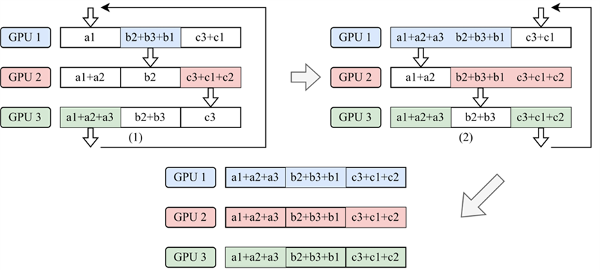
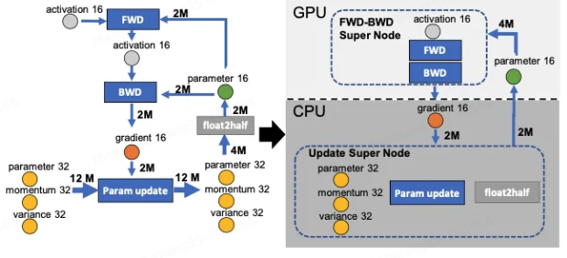

`deepspeed`

+ **背景：** `DistributedDataParallel`

  ```
  from torch.nn.parallel import DistributedDataParallel as DDP
  ```

  `DistributedDataParallel` 背后核心算法：`Ring All Reduce`, 其可以通过 `reduce-scatter` 和 `all-gather` 这两个更基本的通信操作来实现；

  其基本原理是将所有的计算节点配置成一个环状结构，每个节点都与其左右邻居直接相连。在All-reduce操作中，每个节点开始时都有一些本地数据，目的是让所有节点最终拥有所有数据的总和或平均值。

  

  在反向传播阶段，集群中不同卡机执行不同数据(数据并行)，想将各个卡机的梯度信息收集起来，做梯度累积操作；假设 `GPU1`梯度向量是$\rightarrow_{abc}$ , `scatter`分块$[a_1;b_1:c_1]$, 执行`reduce`操作。

  + **reduce-scatter**

    step1 ：每个结点把本设备上的数据分成 N个区块；

    step2 ：在第一次传输和接收结束之后，在每一个结点上累加了其他节点一个块的数据;

    step3 :   每一个节点上都有一个包含局部最后结果的区块;

    

    

  + **all gather**: 

    `All gather`阶段并不需要将接收到的值进行累加，而是直接使用接收到的块内数值去替环原来块中的数值。

  ​       迭代N一1次直到过程结束, 使得每一个节点都包含了全部块数据结果;

  

  ​	 思考：梯度累计问题想明白了，另一个是模型并行时参数分发的问题；例如怎么将 `GPU 1` 中的参数广播到`gpu2` 和`gpu3`上。  最简单实现逻辑：在`gpu2` 和`gpu3`开辟相同空间，执行`all_gather` 操作。

  + **通信开销**：

    假设有 $N$个工作结点，每一个结点中的数据量大小都是$K$, 分块后每个节点每次传输实际数据量$\frac{K}{N}$,   **reduce-scatter** 和 **all gather** 分别循环$N-1$次，故每个节点通信通量是
    $$
    communication = 2 * K*(N-1)/N
    $$

+ `ZERO` 原理：

  ZeRO是一种针对**大规模分布式深度学习**的**新型内存优化技术**。

  **不同stage的区别**

  - Stage 1: 把**优化器状态(optimizer states)**分片到每个数据并行的工作进程(每个GPU)下；
  - Stage 2: 把 **优化器状态(optimizer states) + 梯度(gradients)** 分片到每个数据并行的工作进程(每个GPU)下；
  - Stage 3: 把**优化器状态(optimizer states) + 梯度(gradients) + 模型参数(parameters)** 分片到每个数据并行的工作进程(每个GPU)下。

+ `Zero-Offload`

​        思想:  将训练阶段的某些模型状态放（offload）到CPU内存上；即计算节点和数据节点分布在GPU和CPU上；

​		下图中有四个计算类节点：FWD、BWD、Param update和float2half，前两个计算复杂度大致是 O(MB)， B是batch size，后两个计算复杂度是 O(M)。

​		为了不降低计算效率，将前两个节点放在GPU，后两个节点不但计算量小还需要和Adam状态打交道，所以放在CPU上，Adam状态自然也放在内存中。

​		          

  

推荐篇博客：

[deepspeed多机多卡训练踏过的坑][https://blog.csdn.net/fisherish/article/details/105115272}{https://blog.csdn.net/fisherish/article/details/105115272]

